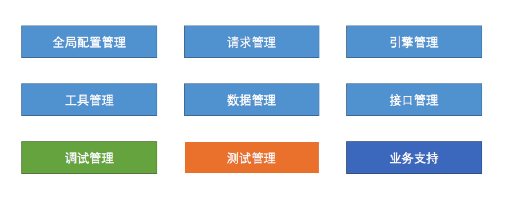
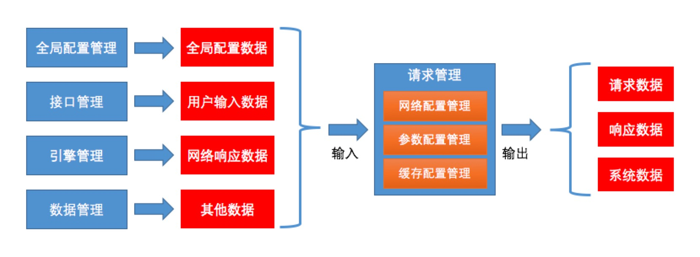
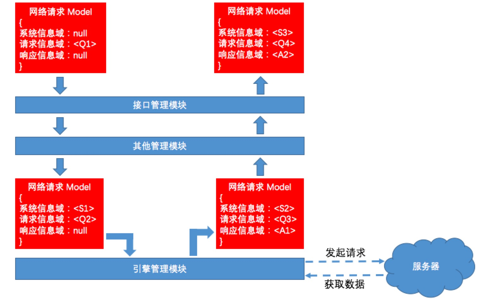
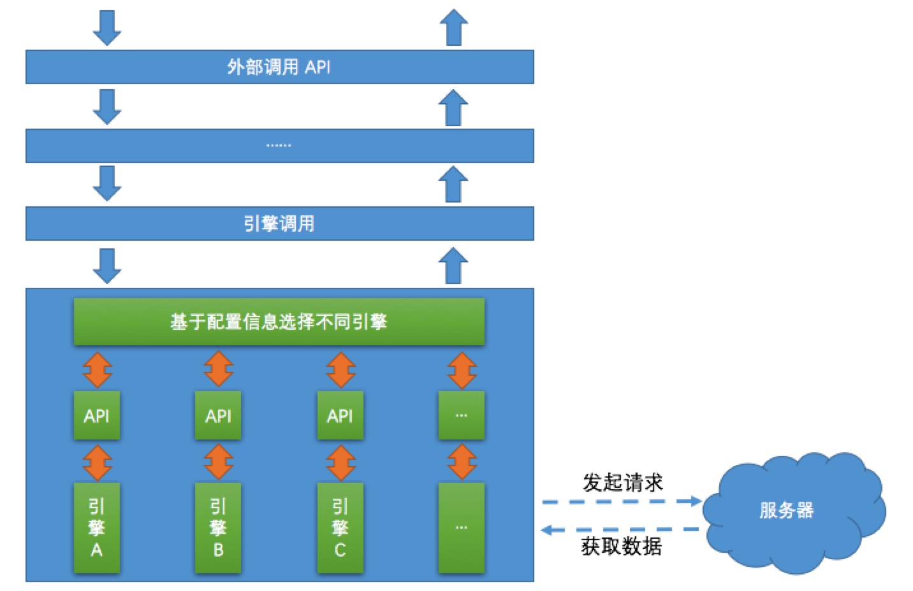
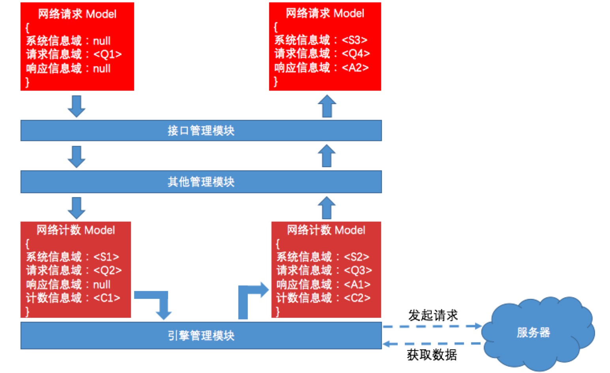
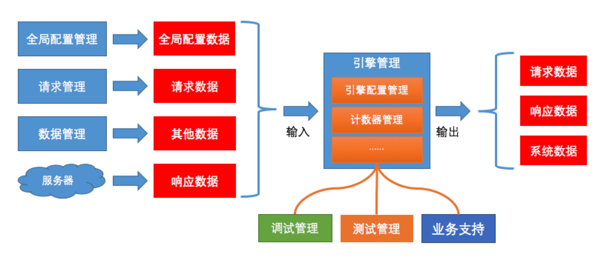

## 克勤小物 | iOS 客户端网络系统设计（一）

### 作者简介

江浩，软件架构师。先后从事 iOS 原生开发、跨平台 SDK 框架开发、React Native、小程序、H5 等前端开发和管理工作。喜欢探究软件技术的原理，同时乐于从工程以及系统的角度分析和解决问题。

### 一、基本介绍

这个系列的文章将介绍如何将客户端网络模块打造为一套独立完整的网络系统。

```
* 系统是一个完整功能的系统，拥有独立的访问方式，和部署方式，拥有完整的生命周期，系统由模块组成;
* 模块是系统的组成部分，不能单独工作，需要依附于系统才能发挥作用，通常是解决一定场景下的问题。
```

#### 1. 基本功能


* 完成业务模块对服务器数据的请求和获取。

#### 2. 扩展功能



* 配置管理：客户端网络请求配置策略动态调整管理；
* 请求管理：请求数据和响应数据的管理；
* 引擎管理：不同网络引擎的便捷切换与测试管理；
* 工具管理：请求以及返回数据的校验、解析、加密、解密、容错等工具的管理；
* 数据管理：配置数据、请求数据、响应数据、缓存数据、模拟数据、测试数据等不同数据的管理；
* 接口管理：同步请求、异步请求、队列请求、原生请求、网络状态与类型检测等接口的管理；
* 调试管理：提供可视化的网络调试功能，通过网络系统数据实现应用内调试功能；
* 测试管理：通过动态录制网络请求、接口、返回等不同的数据，实现网络系统功能的自动化测试功能；
* 业务支持：为了让网络系统更加独立于业务模块而设计的业务支持模块，该模块可以确保需要特殊网络功能支持的业务功通过非侵入式的方式与网络系统交互，从而确保网络系统整体的独立性。

#### 3. 网络系统三大 Model


* 全局配置 Model：网络系统内全局配置数据模型；
* 网络请求 Model：用于业务模块发起网络请求和网络系统返回响应数据的数据模型；
* 网络计数 Model：网络系统内部定义的网络请求 Model 子类，用于网络系统内部网络计数管理。

### 二、详细介绍

#### 1. 全局配置管理模块

该模块主要完成`全局配置数据`的生成工作，`全局配置数据`主要是提供给网络系统内部功能模块和外部业务模块使用。


全局配置管理模块的输入有三个，分别是：

* `应用默认配置数据`：主要是默认全局配置请求参数，写死在应用程序中，比如默认请求方法、超时时间、最大请求次数、请求服务器等；
* `启动生成配置数据`：主要是应用启动时的一些外部请求参数，通过自检测生成或外部生成传入的方式获取，比如应用启动时间、应用启动地点、应用启动版本号等；
* `启动时请求配置数据`：主要是根据当前客户端和服务器状态动态下发的请求参数，通过启动时发起请求获取(请求参数来自`应用默认配置数据`和`启动时生成配置数据`)，比如最近的服务器 IP 地址以及用于网络拨测的测试数据等。

全局配置管理模块的输出主要是`全局配置数据`。`全局配置数据` 主要是全局配置管理模块三大输入数据的集合，该数据的输出方式有两种：

* 一是通过全局配置 Model 的预定义公有成员数据，返回非加密、安全且必要的部分`全局配置数据`
* 二是通过全局配置 Model 的某个特殊公有成员函数，返回加密的全部`全局配置数据`

用于获取全部`全局配置数据`的解密密码通过特殊的方式保存在某个特殊位置，且与应用版本以及网络系统版本相绑定。从而保证了`全局配置数据`既可以通过外部方式获取加密数据以用于`功能监测`，亦可以通过内部方式获取解密数据以用于`功能自检`。

`全局配置数据`内容示例：

```
* 正则表达式校验规则：主要用于校验请求链接的规则和类型；
* 请求配置初始参数：定义了全局管理的初始参数，包括请求标识符、请求域名、字符串标志和校验规则；
* 网络调试模拟可选配置：定义了断网、超时以及失败等各种网络调试所需的模拟场景；
* 默认超时时间：定义了各种可能业务场景的默认超时时间；
* 最大请求次数：定了各种可能业务场景的默认最大请求次数；
* 返回数据校验可选规则枚举：定义了各种可能业务场景的返回数据校验规则；
* 网络状态枚举：定义了网络创建、进行中、取消、获取缓存、获取请求返回和失败状态；
* 异常枚举：定义了诸如网络异常、系统错误、处理完成、参数错误、登陆与授权错误等各种可能的业务异常结果；
* 请求方法枚举：定义了 POST、GET、PUT、PATCH、DELETE等常规网络请求方法；
* 请求标识符枚举：定义了各种请求标识符类型；
* 网络系统模式枚举：开发环境下可提供模式切换，用于业务模块和网络功能开发调试；生产环境下始终返回生产模式；
* ...
```

#### 2. 请求管理模块

该模块主要完成请求数据的生成和响应数据的返回等操作，包括网络配置管理、参数配置管理和缓存配置管理三个子模块。



* 网络配置管理模块：该模块主要包含了请求的域名切换管理、请求参数生成管理、指定请求返回数据校验策略、网络请求中页面交互与展示、请求方法与测试服务器、缓存和业务参数配置等。所有配置参数通过统一的数据模型生成接口生成网络请求 Model，该 Model 将被交由接口管理模块，作为请求的主要输入参数。
* 参数配置管理模块：该模块主要功能是将业务请求参数和全局配置数据组装为包含验证签名等信息的完整请求参数，实际是装填网络请求 Model 请求数据域。该模块之后会将装填完毕的网络请求 Model 递交给引擎管理相关模块用于网络请求。
* 缓存配置管理模块：该模块主要实现缓存功能，由于 iOS 系统原生缓存模块的触发逻辑可能导致缓存无法命中问题，该模块可以实现嵌入的缓存数据生成与读取。缓存配置模块会将缓存配置相关的信息装填至网络请求 Model 系统信息域相关字段。位于网络请求 Model 请求数据域中的初始缓存配置信息经过缓存配置模块重新解析，生成完整的缓存配置参数，该配置参数会被引擎管理相关模块用于确定缓存相关处理规则。

网络请求 Model 包含三个信息域：

* 系统信息域：包含网络系统信息相关的数据字段，根据网络系统的不同模式以及配置的不同会有差异。
* 请求信息域：包含`请求数据`相关的数据字段，承载网络请求相关的信息。
* 响应信息域：包含`响应数据`相关的数据字段，承载网络响应相关的信息。



我们可以将该网络系统的工作流程理解为：

* 将一个仅包含`请求信息域`数据的网络请求 Model 通过调用接口抛进该网络系统；
* 该网络请求  Model 根据网络系统不同的模式和配置在不同的子模块之间穿梭流转，每一次跨模块的穿梭流转都会写入新的数据到`系统信息域`中，同时更新`请求信息域`内容；
* 在经历了网络引擎模块发起请求并获取到服务器返回数据后，将服务器返回数据写入到`响应信息域`，并逐层返回；
* 最终通过回调接口将该 Model 返回给用户。

```
注意：
实际网络请求 Model 在网络系统内部进入引擎模块后，会进行一步封装。转变为网络计数 Model，我们会在引擎模块介绍时再介绍网络计数 Model，同时上图样式会有稍许变化。
```

请求管理模块的输入数据有四类，分别是：

* 来自全局配置管理的`全局配置数据`：主要是通过全局配置 Model 的预定义公有成员数据获取的数据，用于配置网络请求和其他设置；
* 来自接口管理的`用户输入数据`：主要是用户根据业务需求实际需要输入的请求参数和网络配置设置，用于配置网络请求和其他设置；
* 来自引擎管理的`网络响应数据`：主要是网络请求响应的数据，该数据可能因为网络系统的不同模式或其他差异配置而与原始的网络返回数据不同，用于生成`响应数据`并返回给用户；
* 来自数据管理的`其他数据`：主要是来自数据管理的缓存数据、测试数据、调试数据或其他，用于生成`响应数据`并返回给用户。

请求管理模块的输出数据输出主要是`请求数据`、`响应数据`和`系统数据`：

* `请求数据`主要是经过请求管理组装生成的用于向服务器发起请求的数据，存储在网络请求 Model 的`请求信息域`相关字段中；
* `响应数据`主要是经过请求管理组装生成的用于返回给用户的数据，存储在网络请求 Model 的`响应信息域`相关字段中；
* `系统数据`主要是经过请求管理组装生成的用于传递给其他模块和用户的数据，存储在网络请求 Model 的`系统信息域`相关字段中。

请求管理模块中的输出数据除了传递给其他模块用于功能参考和输出，同时也会被缓存在数据管理模块中用于数据录制和测试。具体的缓存策略根据网络系统的不同模式以及配置的不同会有差异。

#### 3. 引擎管理模块

该模块主要完成请求数据的生成和响应数据的返回等操作，核心子模块是引擎配置管理模块和计数器管理模块。

* 引擎配置管理模块：该模块主要用于引擎的选择控制。

网络引擎主要包括：自定义网络引擎、ASIHTTPRequest、AFNetworking、CURL、原生网络引擎以及不同引擎的不同版本等。引擎配置管理模块会根据传入的网络请求 Model 中`系统信息域`相关信息，确定选择何种网络引擎进行网络请求。

常用的引擎选择因素包括：引擎A/B测试（不同引擎或不同版本的性能测试需要）、网络功能测试（网络测速需要）、业务需求（网络降级需要以及调试需要）。



* 计数器管理模块：用于网络计数和数据录制。

狭义的计数器主要用于网络计数需要，用于统计各种不同类型的网络请求个数。广义的计数器包括网络请求和响应数据的录制需要，为网络功能测试以及调试提供底层功能支持。技术及管理模块会生成和维护网络计数 Model。该 Model 存储于数据管理模块，保存了每一次网络请求以及返回的全部信息。

网络计数 Model 是网络请求 Model 的一个子类，除包含正常网络请求的三大信息域（`系统信息域`、`请求信息域`、`响应信息域`）之外，还包括`计数信息域`，用于保存网络计数相关信息（调试、测试、模拟等数据）。



同时引擎管理模块作为网络系统的核心模块，与调试管理模块、测试管理模块以及业务支持模块均有关联。

```
核心引擎管理模块与三大外部模块关联似乎与“高内聚低耦合”的软件架构设计原则相违背。但实际上如果要实现软件系统的调试、测试以及业务支持功能，就离不开对核心引擎模块的监控和管理。在这里，我们利用软件测试中常用的“打桩”方式，来实现调试管理模块、测试管理模块以及业务支持模块的“热插拔”管理。

其原理就是：

* 在三大模块（调试管理模块、测试管理模块以及业务支持模块）中定义特定的“打桩”函数，函数体保留简洁逻辑（埋点逻辑）；
* 在引擎管理模块中特定的位置引入这些“打桩”函数，保留必要的标记和埋点；
* 当参数为空或特定值时，相关接口返回为空或特定值。这些空数据和特定值不会对软件系统的功能逻辑产生影响；
* 当需要调用三大模块功能时，会在外部模块自定义子类并实现“打桩”函数功能，通过传入特定的参数，激活三大模块的逻辑功能；
* 三大模块的功能只在特定条件（调试、测试、业务执行）下会影响引擎管理模块的逻辑，通过不同配置控制开关；
* 当软件系统需要移植时，与业务过分耦合的自定义代码不需要移植，仅保留“打桩”函数简洁逻辑（埋点逻辑）即可。
```



引擎管理模块的输入数据有四类，分别是：

* 来自全局配置管理的`全局配置数据`：主要是通过全局配置 Model 的预定义公有成员数据获取的数据，用于配置网络请求和其他设置；
* 来自请求管理的`请求数据`：主要是经过请求管理模块进一步封装的网络请求 Model，用于发起网络请求并装填服务器返回数据；
* 来自数据管理的`其他数据`：主要是来自数据管理的缓存数据、测试数据、调试数据或其他，用于生成`响应数据`并返回给用户或录入数据管理模块。
* 来自服务器的`响应数据`：主要是网络请求响应的数据，该数据用于生成`响应数据`返回给用户或录入数据管理模块。

引擎管理模块的输出数据输出主要是`请求数据`、`响应数据`和`系统数据`：

* `请求数据`主要是经过请求管理组装生成的用于向服务器发起请求的数据，在引擎管理模块会对请求数据中的部分标志位进行更新，存储在网络请求 Model 的`请求数据域`相关字段中；
* `响应数据`主要是经过引擎管理组装生成的用于返回给其他模块的数据，存储在网络请求 Model 的`响应数据域`相关字段中；
* `系统数据`主要是经过请求管理组装生成的用于传递给其他模块和用户的数据，在引擎管理模块会对系统数据中的部分标志位进行更新，存储在网络请求 Model 的`系统数据域`相关字段中。

引擎管理模块中的输出数据除了传递给其他模块用于功能参考和输出，同时也会被缓存在数据管理模块中用于数据录制和测试。具体的缓存策略根据网络系统的不同模式以及配置的不同会有差异。
